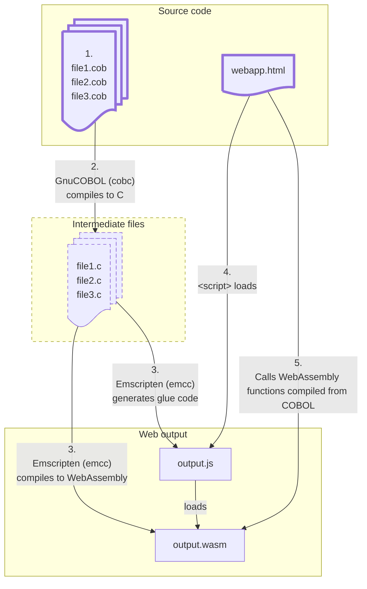

# COBOL-Wasm

This project provides a Docker image to compile COBOL programs to WebAssembly, so they can run in a web browser.

How does it work?



1. You have some COBOL source files.
2. GnuCOBOL (`cobc` compiler) compiles the COBOL files into intermediate C files.
3. Emscripten (`emcc`) compiles the C files into a WebAssembly (`wasm`) file, and creates a JavaScript (`js`) "glue" file.
4. Your web application loads the generated `js` file, which in turn loads the `wasm` file.
5. Your web application's JavaScript calls functions compiled from the COBOL sources using the [Emscripten Module APIs](https://emscripten.org/docs/api_reference/module.html).

See also:
* [Compiling a new C/C++ module to WebAssembly](https://developer.mozilla.org/en-US/docs/WebAssembly/Guides/C_to_Wasm) (Mdn guide)
* [Emscripten documentation for calling C functions from JavaScript](https://emscripten.org/docs/api_reference/preamble.js)

## Usage

```shell
./scripts/cobol-wasm.sh <program1,program2,program3> </path/to/file1.cob> </path/to/file2.cob> ...
```

Example:
To compile a `hello.cob` file which defines a program `MY-PROGRAM` that you wish to call from javascript:

```shell
./scripts/cobol-wasm.sh _MY__PROGRAM /path/to/hello.cob
```
This will produce `hello.js` and `hello.wasm` in the current working directory.

## Example
Try the example:
```shell
./examples/call-cobol-from-js/build.sh
```

Serve the html file at `examples/call-cobol-from-js/AnswerToLife.html`.

For example: 

```shell
python -m http.server -d examples/call-cobol-from-js 8080
```
or

```shell
npx http-server examples/call-cobol-from-js
```

Open the example page at http://localhost:8080/AnswerToLife.html

## Building
### Build the Docker image
To build the docker image:
```shell
docker build -t cobol-wasm .
```

### Build the tools on your machine

You can run the scripts used to build the Docker image, directly on your machine:
```shell
./docker/scripts/build-all.sh
```

This assumes you have a development environment.

Note, if you're on MacOS, you may need to define the "libtoolize" command as `glibtoolize`:
```shell
LIBTOOLIZE=glibtoolize ./docker/scripts/build-all.sh
```

By default, the build will install the following to `/opt`, which you will need to compile COBOL
files to wasm:
* Binaries:
  * `/opt/gnucobol/bin/cobc`
* Headers:
  * `/opt/include/db.h`
  * `/opt/include/gmp.h`
* Wasm libraries:
  * `/opt/lib/libdb-5.3.dylib` (mac) or `/opt/lib/libdb-5.3.so` (linux)
    - This is actually a static library, not a shared library!
  * `/opt/lib/libgmp.a`
  * `/opt/gnucobol-wasm/lib/libcob.a`

If you want to install these files to a location other than `/opt`, set the `PREFIX_ROOT`:
```shell
PREFIX_ROOT=/path/to/install ./docker/scripts/build-all.sh
```

## Disclaimer

⚠️This project has only been tested with the few COBOL source files 
in the examples folder. It has not been used in prouction.

Use at your own risk! 🫠

## License
The files in this repository (shell scripts, Dockerfile, examples, etc.)
are licensed under the MIT License, unless otherwise noted.

This project builds and redistributes GnuCOBOL artifacts inside the Docker
image. Those artifacts remain covered by their original licenses.

GnuCOBOL licensing information:
* GnuCOBOL compiler (`cobc`): GPLv3
* GnuCOBOL runtime library (`libcob`): LGPLv3

See the upstream GnuCOBOL project for details:
https://sourceforge.net/p/gnucobol/code/HEAD/tree/branches/gnucobol-3.x/